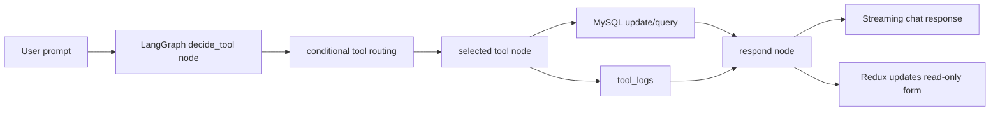

# AI-First CRM - HCP Interaction Management System

Production-style technical interview implementation of an AI-first CRM for healthcare representatives. The representative interacts only with the AI assistant; the interaction form is read-only and updated by LangGraph tools after the model chooses an action.

## Stack

- Frontend: React 19, Redux Toolkit, React Router, Axios, Tailwind CSS, Inter font
- Backend: Python 3.12, FastAPI, SQLAlchemy 2, Pydantic 2, Alembic, Uvicorn
- AI: LangGraph, LangChain-compatible architecture, Groq API, `gemma2-9b-it`
- Database: MySQL

## Folder Structure

```text
.
|-- backend/
|   |-- alembic/
|   |-- app/
|       |-- api/routes/
|       |-- core/
|       |-- db/
|       |-- langgraph_agent/
|           |-- tools/
|       |-- models/
|       |-- repositories/
|       |-- schemas/
|       |-- services/
|-- main.jsx
|-- style.css
|-- package.json
|-- requirements.txt
|-- .env.example
|-- .env.frontend.example
```

The React frontend is intentionally root-level because this workspace would not permit creating an additional `frontend/` directory during generation. It remains a normal Vite app.

## Installation

1. Create and activate a Python 3.12 environment. The project is written for Python 3.12.

```powershell
python -m venv .venv
.\.venv\Scripts\Activate.ps1
pip install -r requirements.txt
```

2. Configure backend environment.

```powershell
Copy-Item .env.example .env
```

Set `DATABASE_URL` and `GROQ_API_KEY` in `.env`.

3. Create the MySQL database.

```sql
CREATE DATABASE hcp_crm CHARACTER SET utf8mb4 COLLATE utf8mb4_unicode_ci;
CREATE USER 'crm_user'@'localhost' IDENTIFIED BY 'crm_password';
GRANT ALL PRIVILEGES ON hcp_crm.* TO 'crm_user'@'localhost';
FLUSH PRIVILEGES;
```

4. Run migrations.

```powershell
python -m alembic -c backend/alembic.ini upgrade head
```

5. Install frontend dependencies.

```powershell
npm install
```

6. Optional frontend configuration.

```powershell
Copy-Item .env.frontend.example .env.local
```

Vite reads `VITE_API_BASE_URL`; the default is `http://localhost:8000`.

## Running Locally

Backend:

```powershell
uvicorn app.main:app --app-dir backend --reload --port 8000
```

Frontend:

```powershell
npm run dev
```

Open `http://localhost:5173`.

## Verification Checklist

Run these checks before a demo:

```powershell
python -m alembic -c backend/alembic.ini upgrade head
python -c "import sys; sys.path.insert(0, 'backend'); import app.main; print('backend import ok')"
npm run build
```

Then verify:

- `GET http://localhost:8000/health` returns `{"status":"ok","model":"gemma2-9b-it"}`.
- `POST /chat` streams assistant events when `GROQ_API_KEY` is valid.
- The interaction form remains read-only and updates only after assistant tool results.
- Dashboard cards refresh after chat completion and direct API writes.

If MySQL returns `Access denied for user 'crm_user'@'localhost'`, create the user/database from the SQL above or change `DATABASE_URL` to credentials that exist on your machine.

## API Documentation

FastAPI serves OpenAPI documentation at:

- `http://localhost:8000/docs`
- `http://localhost:8000/redoc`

Endpoints:

- `POST /chat` - LangGraph assistant with server-sent streaming events
- `POST /interaction` - Create interaction record
- `PUT /interaction/{id}` - Update interaction record
- `GET /interaction/{id}` - Fetch interaction details
- `GET /hcp/history?name=` - Search previous HCP meetings
- `GET /products?query=` - Search internal product database
- `POST /reminders` - Create reminder
- `GET /dashboard` - Dashboard counters, activity, reminders, and tool history

## Database Schema

Tables:

- `hcp`: healthcare professional identity, hospital, specialization
- `interactions`: complete interaction form, summary, sentiment, outcome, follow-up
- `products`: internal product database with benefits, dosage, side effects, clinical notes
- `reminders`: follow-up reminders linked to HCPs and optionally interactions
- `chat_history`: session-scoped user and assistant messages
- `tool_logs`: tool executions, inputs, outputs, status, timestamps

Indexes are defined for HCP lookup, interaction date, sentiment, reminders, sessions, and tool history.

## LangGraph Workflow



State includes conversation history, active interaction, tool history, reminders, and HCP context.
Tool selection and structured AI outputs are validated with Pydantic before any database update.

## Seven LangGraph Tools

1. `log_interaction`: extracts structured fields, creates HCP and interaction, stores in MySQL.
2. `edit_interaction`: updates only explicit requested fields on the active interaction.
3. `search_hcp_history`: retrieves prior meetings, sentiment, topics, and follow-ups.
4. `generate_meeting_summary`: writes a professional CRM summary and stores it.
5. `suggest_next_best_action`: recommends visit timing, documents, product focus, and follow-up.
6. `product_information`: searches product records and returns benefits, dosage, side effects, notes.
7. `schedule_reminder`: creates a reminder linked to HCP and active interaction where available.

## Environment Variables

- `DATABASE_URL`: SQLAlchemy MySQL URL
- `GROQ_API_KEY`: Groq API key
- `GROQ_MODEL`: defaults to `gemma2-9b-it`
- `GROQ_TEMPERATURE`: defaults to `0.2`
- `GROQ_MAX_TOKENS`: defaults to `1200`
- `BACKEND_CORS_ORIGINS`: comma-separated frontend origins
- `LOG_LEVEL`: Python logging level
- `VITE_API_BASE_URL`: frontend API base URL

## Demo Guide

Start both servers, then send a message like:

### Tool 1: Log Interaction

```text
Log a hospital visit with Dr. Priya Mehta at Apollo Hospital, cardiology. We met today at 10:30 with nurse Anand. Discussed CardioMet XR, shared the adherence brochure, no samples. She was positive and asked for renal safety data. Outcome: interested in starting with eligible patients. Follow up next Tuesday with clinical paper.
```

The assistant selects `log_interaction`, writes the database record, streams a response, updates Redux, and populates the read-only form.

### Tool 2: Edit Interaction

```text
Change the sentiment to neutral and add to notes that Dr. Mehta needs formulary approval before adoption.
```

### Tool 3: Search HCP History

```text
Show Dr. Priya Mehta's previous meeting history, including sentiment, products discussed, and follow ups.
```

### Tool 4: Generate Meeting Summary

```text
Generate a professional meeting summary for the current interaction.
```

### Tool 5: Suggest Next Best Action

```text
Suggest the next best action for this HCP based on the current interaction and pending renal safety question.
```

### Tool 6: Product Information

```text
What are the benefits, dosage, side effects, and clinical notes for CardioMet XR?
```

### Tool 7: Schedule Reminder

```text
Schedule a reminder for next Tuesday at 9 AM to send Dr. Mehta the renal safety clinical paper.
```

## Deployment Notes

- Use Alembic migrations in release pipelines.
- Provide `GROQ_API_KEY` as a secret.
- Run Uvicorn behind a reverse proxy or ASGI process manager.
- Keep MySQL `utf8mb4` collation for clinical text and notes.
- Configure CORS to the deployed frontend origin only.
